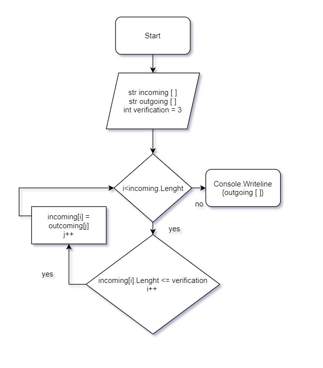

 описание программы:
 Решение задачи начинаем с создания входящего массива incoming[], после чего делаем запрос на ввод данных пользователю и собираем эти данные в массив.

 Принимаем, что массив будет состоять из четырёх строк.
 После того, как пользователь ввёл данные переходим к обработке.

Решение состоит из двух методов. 

Первый метод SortingArray принимает входящий массив сравнивает длину строки с переменной variable, которая равна (по условию задачи) 3.
В случае, если длина строки меньше или равна трёх знаков, то строка сохраняется в новый массив.

После того, как метод перебрал все строки, возвращаем полученный массив array2. 

Второй метод PrintArray описывает внешний вид выдаваемых данных. 

В итоге программа выводит входящий массив, а затем выводит обработанный.

